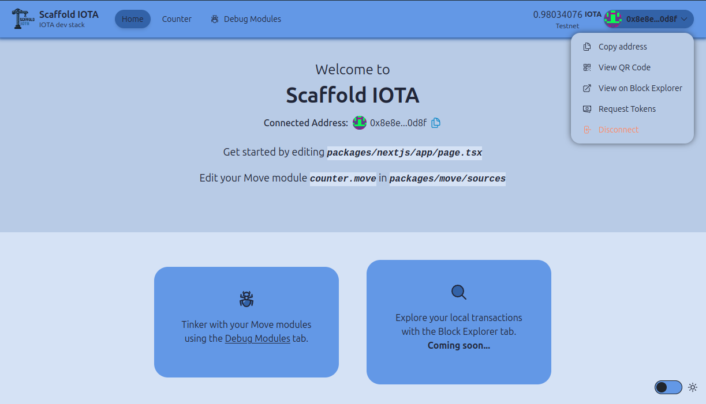

# 🏗 Scaffold IOTA

<div align="center">


<h4 align="center">
  <a href="TODO">Documentation</a> |
  <a href="TODO">Website</a>
</h4>
</div>

🧪 Scaffold IOTA is an open-source, cutting-edge toolkit for building decentralized applications (dApps) on IOTA. It's designed to streamline the process of creating and deploying Move smart contracts and building user interfaces that interact seamlessly with these smart contracts.

⚙️ Built using Move, IOTA TS SDK, IOTA dApp Kit, Next.js, Tailwind CSS, and TypeScript.

* 🛫 **Deployment Scripts**: Simplify and automate your deployment workflow.
* ✅ **Hot Contract Reload**: Your frontend automatically adapts to changes in your smart contracts as you redeploy them.
* 🪝 **Custom Hooks**: A collection of React hooks to simplify interactions with the IOTA blockchain.
* 🧱 **Components**: A library of common Web3 components to rapidly build your frontend.
* 🔐 **Wallet Integration**: Connect to any IOTA-compatible wallet and interact with the IOTA network directly from your frontend.

Perfect for hackathons, prototyping, or launching your next IOTA project!



## Project Structure
```packages/
├── move/               # Move smart contracts and tests
│   ├── sources/       # Smart contract source files
│   ├── test/          # Contract test files
│   └── utils/         # Utility scripts
├── nextjs/            # Frontend application
    ├── app/           # Next.js application code
    ├── components/    # Reusable React components
    └── hooks/         # Custom React hooks
```


## Requirements

Before you begin, you need to install the following tools:

- [Node (>= v18.17)](https://nodejs.org/en/download/)
- Yarn ([v1](https://classic.yarnpkg.com/en/docs/install/) or [v2+](https://yarnpkg.com/getting-started/install))
- [Git](https://git-scm.com/downloads)
- [IOTA CLI](https://docs.iota.org/developer/getting-started/install-iota)

## Quickstart

To get started with Scaffold IOTA, follow the steps below:

1. Clone this repo & install dependencies

```
git clone https://github.com/arjanjohan/scaffold-iota.git
cd scaffold-iota
yarn install
```

2. Then, initialize the IOTA client with this command.

```
yarn client
```

This command sets up the IOTA client if it hasn't already. It prompts you to select a network (defaults to IOTA testnet if you just press `Enter`). Finally, you will be prompted to select the key scheme you want to use. If you are unsure which scheme to use just go with the default ed25519 scheme (option 0).

3. Deploy the test modules:

```
yarn deploy
```

This command deploys the move modules to the network configured in the previous step. The modules are located in `packages/move/sources` and can be modified or replaced to suit your needs. The `yarn deploy` command uses `iota client publish` to publish the modules to the network. After this is executes the script located in `scripts/load-modules.ts` to make the new modules available in the nextjs frontend.

4. On a second terminal, start your NextJS app:

```
yarn start
```

Visit your app on: `http://localhost:3000`. You can tweak the app config in `packages/nextjs/scaffold.config.ts`.

**Note:** For a comprehensive list of available yarn commands and their usage, please refer to our [documentation](https://scaffold-iota-docs.vercel.app/commands).

**What's next**:

- Edit your smart contract `counter.move` in `packages/move/sources`
- Edit your frontend homepage at `packages/nextjs/app/page.tsx`. For guidance on [routing](https://nextjs.org/docs/app/building-your-application/routing/defining-routes) and configuring [pages/layouts](https://nextjs.org/docs/app/building-your-application/routing/pages-and-layouts) checkout the Next.js documentation.
- Edit your Move tests in: `packages/move/test`. To run test use `yarn test`

## Next steps

I successfully implemented the core features essential for IOTA developers, providing a great starting point with Scaffold IOTA. This version offers a streamlined development experience with hot module reloading, custom hooks, and seamless wallet integration.

In the scope of this hackathon, it was not possible to complete everything. Here's a list of issues (big and small) that are still on the roadmap:

- Add type safety for `useScafffoldSubmitTransction` function arguments. Module name and function names are working correctly with type safety.
- Combine the `useScafffoldSubmitTransction` and `useSubmitTransction` hooks to accept addresses, and apply type safety only when address is not provided.
- Fix and enable network switching (currently blocked by [this issue](https://discord.com/channels/1341659158071611445/1368142371426144266)).
- Update `filterAndSortTokenBalances` to use metadata instead of cointype.

## Issues I ran into during development

#### Wallet popup not showing
In `layout.tsx` I had to add 2 css files to fix it. See [this Discord discussion](https://discord.com/channels/1341659158071611445/1360255915110039612) where the solution was posted. I will propose to either mention these `.css` files in the developer docs or make a fix to wallet so they arent needed anymore. [I created a PR on the IOTA doc for this](https://github.com/iotaledger/iota/pull/6722).

## Links

- [Demo video](https://youtu.be/3OafOIEh72E)
- [Pitchdeck](https://docs.google.com/presentation/d/1Mxo4JYkDpEcYhN80ku1A6z0SFwhSCSkPkt35yUBfbBE/edit?usp=sharing)
- [Documentation](https://scaffold-iota-docs.vercel.app/)
- [Example deployment](https://scaffold-iota.vercel.app/)
- [Github](https://github.com/arjanjohan/scaffold-iota)
- [Documentation Github](https://github.com/arjanjohan/scaffold-iota-docs)

## Credits

None of this would have been possible without the great work done in:
- [Scaffold-ETH 2](https://github.com/scaffold-eth/scaffold-eth-2)
- [IOTA Core repo](https://github.com/iotaledger/iota)
- [IOTA dApp Kit](https://docs.iota.org/ts-sdk/dapp-kit/)
- [IOTA TypeScript SDK](https://docs.iota.org/ts-sdk/typescript/)

## Built during the IOTA Moveathon APAC Hackathon by

- [arjanjohan](https://x.com/arjanjohan/)
